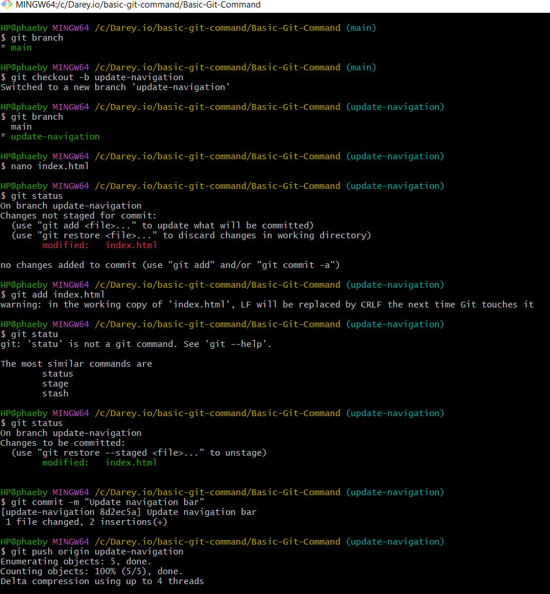
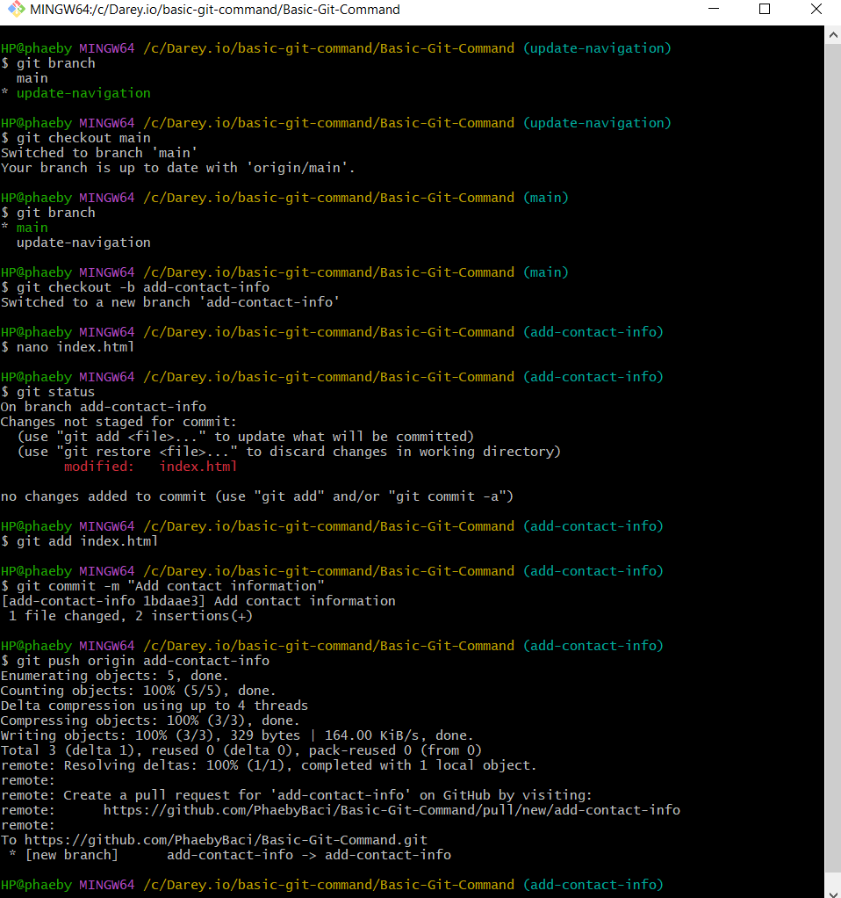
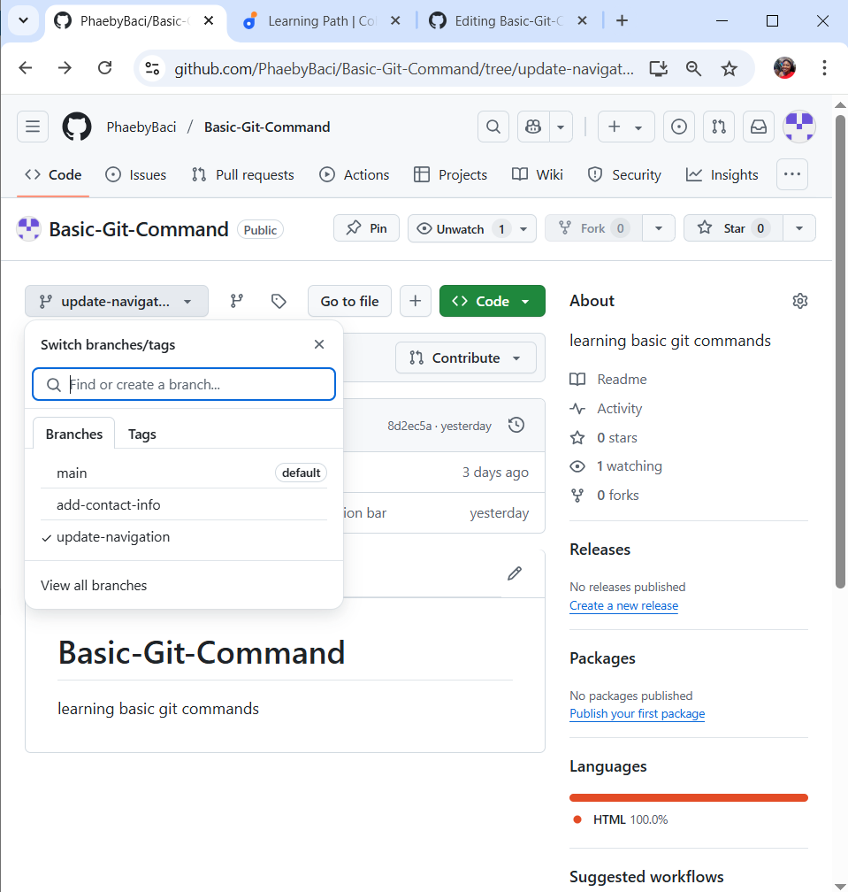
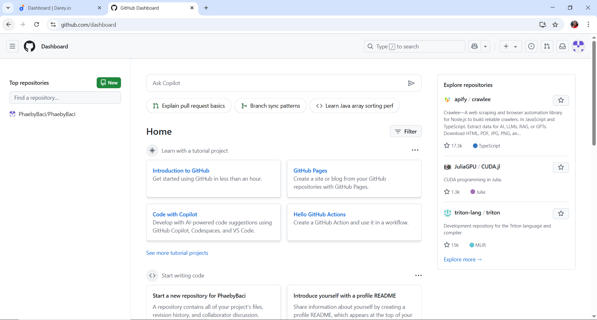

# Basic-Git-Command

## Git Repository setup

## Git basic commands
## Git cloning

## Basic git commands

## Git Repository initialization

## git commit and git push command

## Tom Branch Workflow

### TOM Merging

## Jerry Branch Workflow  

###  Jerry's conflict

## Conflict resolved

### Jerry merging

## GitHub Repository Submission

## GitHub user dashboard

# GIT BRANCHING AND MERGING

## Navigating to github repository

## CREATING PULL REQUEST

## MERGING TOM'S BRANCH

## ADDING JERRY'S CONTRIBUTION

## BASIC COMMANDS

